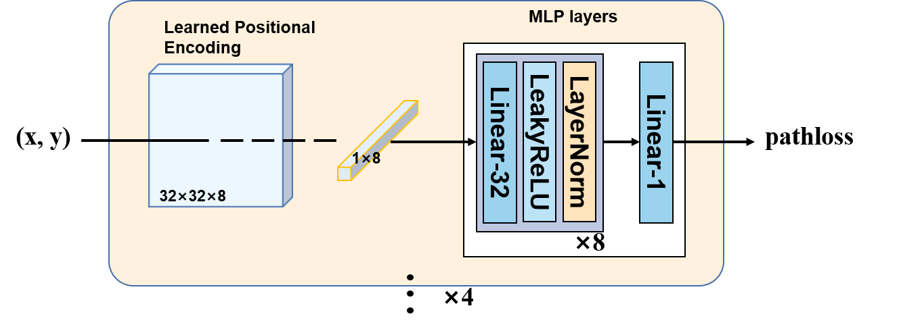
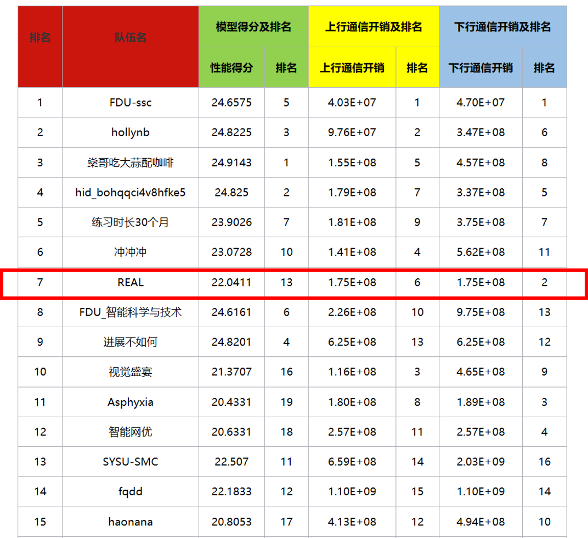

# Intelligent-Distributed-Wireless-Radio-Map-Construction

The 7th Place Solution of the First 6G Intelligent Wireless Communication System Competition - Intelligent Distributed Wireless Radio Map Construction Category
[Competition Homepage](https://competition.huaweicloud.com/information/1000041842/introduction)
## Intro
The deep integration of communication and artificial intelligence technology has become one of the most important directions for the development of wireless communication systems. In the context of 6G, how to integrate communication and AI is a hot research topic. This paper focuses on the construction technology of distributed radio maps and aims to solve the problem of low efficiency and accuracy in modeling distributed 6G radio maps using deep learning methods. Specifically, this paper models multiple channels in the communication signal separately and uses a learnable position encoding to improve the learning efficiency of the distributed model. Experimental results demonstrate that our method achieves high-precision modeling results with very low communication overhead. In the end, our method achieved an accuracy of 22.04 and a communication consumption of 1.75E+8, ranking seventh in the competition.

## Method
Since the total number of rounds for distributed training is limited to 500 rounds, the maximum number of local training rounds for each distributed point is set to 10 rounds per round of training. Therefore, when designing the method, it is necessary to consider how to make the model quickly converge on data from different domains and minimize the number of parameters required by the model to reduce communication consumption during training. Meanwhile, since there is no obvious correlation between the signal strengths received by different base stations, we choose to model the radio map separately for different base stations.

The overall architecture of the model used in this paper is shown in Figure 2. First, we input the coordinates (x, y) into our learnable position encoding module, which has a dimension of H × W × D. In our specific implementation, we found that setting H=32, W=32, and D=8 gives the best results. After obtaining the position encoding, we use a multi-layer perceptron to predict the path loss value of the current channel. Our multi-layer perceptron can be divided into two parts. The first part consists of eight repeated perceptron modules, each consisting of a linear layer with an input dimension of 32 and an output dimension of 32, a LeakyReLU activation layer, and a LayerNorm normalization layer. The LeakyReLU can introduce more learnable information into the task, and the LayerNorm can obtain a stable distribution of latent variables, which is more conducive to the model's learning of channel information. The second part is a linear projection layer, which is responsible for projecting the features with a dimension of 32 to the radio map intensity with a dimension of 1.
Using the above method, our model can accurately model the radio map formed by a single base station. We only need to concatenate the output results to obtain the radio map for all channels. We did not make too many changes to the training method. It is worth noting that we adjusted the local training epochs to 10 and the batch size to 512, which slightly helped to speed up the convergence and improve the accuracy of the model.

## Results
We ultimately achieved a ranking of 7th place in the online competition. Both the uplink and downlink communications were 1.75E+08, and the accuracy score was 22.0411. Our method did not optimize the communication method to reduce communication consumption, but only relied on reducing the communication volume by reducing the size of the model itself. If some local parameter transmission or gradient compression methods can be combined, it should be possible to further reduce communication consumption. Due to limited personal resources, this part of the work will be explored in the future.

## Reference
[1] Imai T, Kitao K, Inomata M. Radio propagation prediction model using convolutional neural networks by deep learning[C]//2019 13th European Conference on Antennas and Propagation (EuCAP). IEEE, 2019: 1-5.

[2] Levie R, Yapar Ç, Kutyniok G, et al. RadioUNet: Fast radio map estimation with convolutional neural networks[J]. IEEE Transactions on Wireless Communications, 2021, 20(6): 4001-4015.
